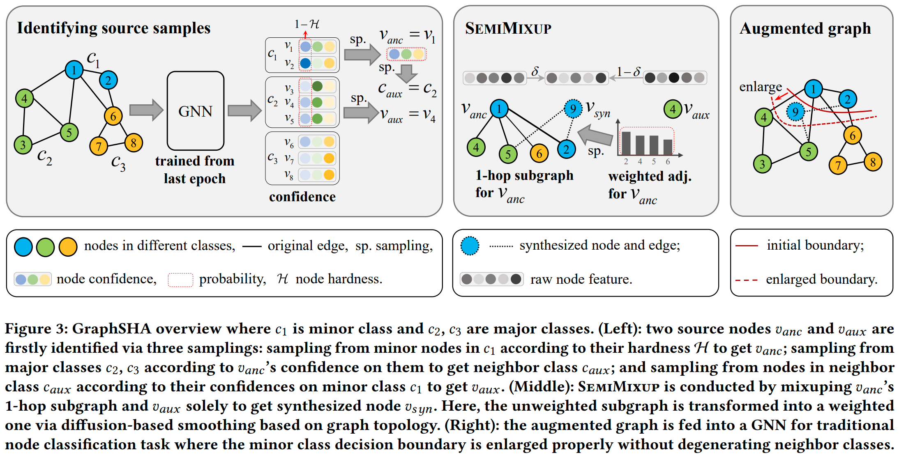

# GraphSHA: Synthesizing Harder Samples for Class-Imbalanced Node Classification

Implementation of KDD'23 paper [GraphSHA: Synthesizing Harder Samples for Class-Imbalanced Node Classification](https://arxiv.org/abs/2306.09612).



## Requirements

This repository has been tested with the following packages:

- Python == 3.8.13
- PyTorch == 1.11.0
- PyTorch Geometric == 2.0.4

Please follow official instructions to install [Pytorch](https://pytorch.org/get-started/previous-versions/) and [Pytorch Geometric](https://pytorch-geometric.readthedocs.io/en/latest/notes/installation.html).

## Important Hyper-parameters

- `--dataset`: name of the dataset. Could be one of `['Cora', 'CiteSeer', 'PubMed', 'Amazon-Photo', 'Amazon-Computers', 'Coauthor-CS']`. 
- `--data_path`: the path to the dataset. The dataset will be downloaded to this path automatically when the code is executed for the first time.
- `--imb_ratio`: imbalance ratio.
- `--net`: GNN backbone. Could be one of `['GCN, GAT, SAGE']`.
- `--gdc`: way to get the weighted graph. Could be one of `['ppr', 'hk', 'none']`.

Please refer to [args.py](args.py) for the full hyper-parameters.

## How to Run

Pass the above hyper-parameters to `main.py`. For example:

```
python main.py --dataset Cora --data_path dataset/ --imb_ratio 100 --net GCN --gdc ppr
```

## License
MIT License

## Contact 
Feel free to email (liwzh63 [AT] mail2.sysu.edu.cn) for any questions about this work.

## Acknowledgements

The code is implemented based on [GraphENS](https://github.com/JoonHyung-Park/GraphENS) and [ReNode](https://github.com/victorchen96/ReNode).

## Citation

If you find this work is helpful to your research, please consider citing our paper:

```
@article{li2023graphsha,
  title={GraphSHA: Synthesizing Harder Samples for Class-Imbalanced Node Classification},
  author={Wen-Zhi Li and Chang-Dong Wang and Hui Xiong and Jian-Huang Lai},
  journal={arXiv preprint arXiv:2306.09612},
  year={2023}
}
```


